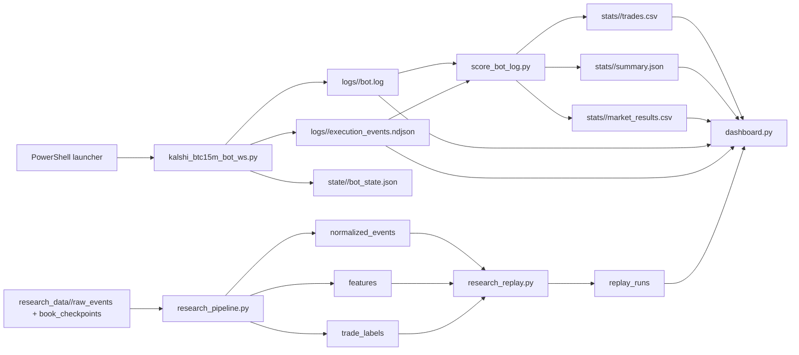

# Kalshi BTC15M Bot Workspace

This repository is a Windows-first BTC 15-minute Kalshi trading workspace. It contains:

- the live trading engine in `kalshi_btc15m_bot_ws.py`
- the trade scorer in `score_bot_log.py`
- the Streamlit operator dashboard in `dashboard.py`
- a research pipeline and replay lab under the `research_*` scripts

The codebase is opinionated around one product only:

- Kalshi series: `KXBTC15M`
- execution style: websocket-driven market watching plus REST order submission
- operational model: one active market at a time, strategy-tagged storage, local logs and state

## What Is In Here

The project has four main layers:

1. The bot watches the currently active BTC15M market, maintains a live order book, decides whether to enter, and manages exits.
2. The scorer turns bot logs plus execution telemetry into `trades.csv`, `summary.json`, and `market_results.csv`.
3. The dashboard reads those scored outputs, live logs, and research artifacts to provide the operating view.
4. The research scripts convert recorder data into normalized datasets, feature tables, labeled trades, replay summaries, and optimizer outputs.

## Quick Start

Create the base environment:

```powershell
powershell -ExecutionPolicy Bypass -File .\setup_windows.ps1
```

Install the dashboard packages:

```powershell
powershell -ExecutionPolicy Bypass -File .\setup_dashboard.ps1
```

Run the current live 90/70 profile:

```powershell
powershell -ExecutionPolicy Bypass -File .\run_bot_live_90_70_size10.ps1
```

Run the dashboard:

```powershell
powershell -ExecutionPolicy Bypass -File .\run_dashboard.ps1
```

Then open [http://127.0.0.1:8501](http://127.0.0.1:8501).

## Current Architecture



## Repository Map

- `kalshi_btc15m_bot_ws.py`: live bot, REST client, websocket loop, order book, entry logic, exit logic, persistence, execution telemetry
- `score_bot_log.py`: parses bot logs and execution telemetry into scored trades and summary files
- `dashboard.py`: main Streamlit command center
- `dashboard_overview_apple.py`: experimental overview-only redesign that reuses helpers from the main dashboard
- `research_pipeline.py`: converts recorder NDJSON into normalized Parquet events, 1-second features, and labeled trades
- `research_ingestor.py`: watches raw research inputs and reruns the pipeline when new files land
- `research_replay.py`: builds replay summaries, direct quote replay, and raw-recorder optimizer artifacts
- `research_optimizer.py`: optimizer-only wrapper around the raw ticker replay grid
- `research_best_strategy.py`: searches continuation and ladder strategies without stop losses
- `research_regime_portfolio.py`: builds a session-by-session portfolio of different BTC15M tactics
- `research_failed_certainty.py`: backtests a failed-certainty reclaim and flip idea
- `RESEARCH_DATA_PIPELINE_SPEC.md`: target design doc for the research stack

## Naming And Path Model

Three names matter in this project:

- `STRATEGY_TAG`: the logical strategy name and live approval identity
- `BOT_STORAGE_TAG`: where the bot writes `logs/` and `state/`
- scorer output tag: where `stats/` files are written

The important paths are:

- `logs/<source_tag>/bot.log`
- `logs/<source_tag>/execution_events.ndjson`
- `state/<storage_tag>/bot_state.json`
- `stats/<dataset_tag>/trades.csv`
- `stats/<dataset_tag>/summary.json`
- `stats/<dataset_tag>/market_results.csv`
- `research_data/<dataset_tag>/...`

The dashboard also supports virtual dataset names like `live_90_70` and `live_90_78`. Those let it point one dataset view at a specific source log stream and a matching scored output folder.

## Supported Runtime Profiles

The current bot code hard-validates a narrow set of live profiles:

- `90/70` without the pre-entry std-dev filter
- `90/78` without the pre-entry std-dev filter
- legacy `90/60` only when the pre-entry std-dev filter is enabled

Important consequence:

- the current bot should be launched through the PowerShell profile scripts, not by trusting raw `.env` defaults
- the repo contains historical launcher scripts and historical datasets for `87/77/67`, `87/90/93`, and `95 momentum`, but the current `validate_config()` logic would reject those profiles if you tried to run them through the present bot code unchanged
- `run_bot_live_90_78_size5.ps1` is historically named; the script currently sets `POSITION_SIZE=10`

## Launchers

Current bot-compatible launchers:

- `run_bot_live_90_70_size10.ps1`: live 90/70 profile
- `run_bot_live_90_78_size5.ps1`: live 90/78 profile
- `run_bot_dry_90_78.ps1`: dry-run profile

Dashboard and research launchers:

- `run_dashboard.ps1`: main dashboard on port `8501`
- `run_dashboard_overview_apple.ps1`: experimental overview-only dashboard on port `8502`
- `run_research_ingestor_live_90_70.ps1`: background pipeline watcher for the `live_90_70` research dataset

## Live Bot Logic

### Core Runtime Loop

At startup the bot:

1. Loads config from `.env` plus launcher overrides.
2. Resolves `state/<tag>/bot_state.json` and `logs/<tag>/bot.log`.
3. Opens `logs/<tag>/execution_events.ndjson` if execution telemetry is enabled.
4. Acquires `state/live_trading.lock` in live mode so only one live bot instance can run.
5. Performs a bootstrap safety check against persisted state and live account state.
6. Starts background account-state refresh and optional BTC volatility regime polling.
7. Enters a tight decision loop, defaulting to `0.05s`, while also reacting immediately to websocket updates.

Each cycle it does:

1. Refresh the current watch market through REST if needed.
2. Ensure the websocket task is connected to the current market.
3. Reconcile any legacy or recovered pending order state.
4. Try the entry path.
5. Try the exit path.
6. Emit heartbeat log lines on the configured heartbeat interval.

### Market Selection And Market Data

The bot does not subscribe to the whole series at once. It uses REST to find the currently active BTC15M market, then watches only that market.

REST discovery:

- series is locked to `KXBTC15M`
- it requests `open` and `initialized` markets
- it keeps only BTC15M tickers
- it chooses the soonest market whose close time is not already stale

Websocket subscriptions:

- `ticker`
- `orderbook_delta`

The in-memory order book is bids-only, because that is what Kalshi exposes most directly here. The bot infers asks by using the opposite side's best bid:

- YES ask is inferred from the NO bid side
- NO ask is inferred from the YES bid side

The order book trust state can be:

- `cold`
- `synced`
- `degraded`
- `resyncing`

If a sequence gap is detected, the bot marks the book degraded, emits a `book_resync` telemetry event, and reconnects the market websocket.

## Entry Hot Path

This is the most important entry flow in the project.

### Entry Detection

The bot only considers entry when all of the following are true:

- no open position
- no pending legacy order state
- no order currently inflight
- current market has not already been traded in this run history
- a fresh order book snapshot exists

Entry signal formation:

1. Build YES and NO ask values from ticker data or inferred cross-book values.
2. Check whether either side is at or above `TARGET_ENTRY_ODDS_CENTS`.
3. Require exactly one side to be triggered. If both sides or neither side qualify, the signal is discarded.
4. Compute:
   - top-of-book buy limit
   - executable buy limit for the full desired size
   - executable visible depth
   - book age
   - seconds to close
   - a material signal signature used for suppression and telemetry

### Entry Filters And Deferrals

Before building an order plan, the bot may reject or defer the signal for these reasons:

- stale book
- dead market state such as not marketable or zero visible depth
- optional pre-entry std-dev filter on recent ask history
- optional BTC volatility regime gate
- missing or stale live account snapshot
- insufficient available balance after fee and cash buffers
- conflicting resting orders already sitting on the same market
- too little time left before close
- insufficient visible depth
- fast-fill gate failures

The fast-fill gate is especially important in the 90/78 profile. It checks:

- minimum seconds to close
- minimum visible depth
- minimum time spent in a continuously executable window
- minimum modeled net edge after estimated fees and slippage budget

Many of these deferrals are suppression-aware. The bot intentionally avoids spamming the same rejected signal every loop if the book has not materially changed.

### Entry Plan Construction

If the signal survives gating, the bot builds a `LiveFillPlan` and then an `ExecutionPlan`.

The plan decides:

- final limit price
- required depth cushion
- whether the order is `fill_or_kill` or `immediate_or_cancel`
- whether the entry should be a single order or split into slices

General behavior:

- if full size is clearly available and policy allows it, the bot can choose `fill_or_kill`
- otherwise it favors `immediate_or_cancel`
- when slicing is enabled, it can use either a fixed pattern or an adaptive slice size based on visible depth

### Entry Submission

The current entry execution path uses `submit_single_order()` and updates state directly from the returned fill information rather than relying on the older `pending_order` path.

Submission flow:

1. Emit `order_submit_start` telemetry.
2. Submit a signed REST order.
3. Emit `order_submit_success` or `order_submit_reject`.
4. Aggregate fills across all slices.
5. If anything filled, persist a `PositionState`.
6. Mark the market as traded so it is not re-entered.

If a partial entry is allowed and enabled, the bot may run a short completion loop:

- only while the market is still the watched market
- only while the book is synced and fresh
- only while time-to-close remains safe
- only while the current top-of-book price stays inside the configured completion range

This means the entry hot path is not just "signal then order". It is:

1. quote detection
2. live book validation
3. risk and freshness gates
4. fill-policy selection
5. optional slicing
6. optional partial completion top-up
7. state persistence
8. execution telemetry

## Exit Hot Path

The exit path is at least as important as the entry path and is more adaptive.

### Exit Detection

The bot checks exits only when:

- a position exists
- the current watch market matches the position market
- no order is inflight
- no legacy pending order is unresolved
- the post-fill hold timer has expired

The default enforced hold delay is fixed by validation:

- `POST_FILL_EXIT_DELAY_SECONDS = 30`

Exit signal formation:

1. Read the ask on the held side.
2. If the held ask is still above the configured stop threshold, do nothing.
3. If the held ask falls to or below `EXIT_DROP_ODDS_CENTS`, create an exit signal.
4. Classify the stop as:
   - `soft` if it crossed the regular stop
   - `panic` if it crossed the deeper panic threshold
5. Measure executable sell limit, visible depth, book age, seconds to close, and nearby bid ladder depth.

### Exit Confirmation

Soft stops do not fire instantly. They must satisfy a confirmation gate:

- `EXIT_CONFIRM_CHECKS`
- or `EXIT_CONFIRM_SECONDS`

Panic stops bypass this confirmation and are allowed immediately.

### Exit Capacity Estimation

Once an exit signal is confirmed, the bot estimates how hard it may be to get out:

- depth available at the current executable limit
- depth one cent lower
- depth two cents lower
- full-size fill ratios
- whether the book appears to be collapsing
- urgency state: `controlled`, `elevated`, `urgent`, or `panic`

That estimate drives the recommended execution mode:

- `single_shot_ioc`
- `adaptive_ioc_slices`
- `reprice_retry_ioc`
- `panic_liquidation`

### Exit Plan And Retries

If the book is usable, the bot builds an `ExitPlan` with:

- limit price
- urgency state
- recommended mode
- max retry count
- adaptive slice ladder if needed

Then it submits slices one by one. After every zero-fill or partial-fill condition, it may:

- rebuild the exit plan from the latest book state
- reduce the limit by `EXIT_RETRY_TICK_STEP_CENTS`
- cap how far it crosses by `EXIT_PANIC_MAX_CROSS_CENTS`
- switch to a more urgent mode
- back off for `EXIT_RETRY_BACKOFF_MS`

The exit hot path therefore looks like:

1. held-side ask breaches stop
2. confirmation gate or panic bypass
3. estimate live exit capacity
4. choose mode and slices
5. submit IOC sell slices
6. reconcile remaining position size
7. retry with repricing if necessary
8. clear the position when fully exited

## Persistence, Safety, And Telemetry

### Persisted Runtime State

The bot persists:

- current position
- legacy pending order state
- exit confirmation state
- recently traded markets

This lets it recover after restarts and avoid immediately re-entering the same market.

### Live Safety Rails

Important live protections:

- series is hard-locked to `KXBTC15M`
- live mode requires `LIVE_APPROVED_STRATEGY_TAG` to exactly match the active strategy tag
- only one live bot may hold `state/live_trading.lock`
- the bot refuses to trade non-BTC15M tickers
- the bot refuses entry when position state already exists
- the bot refuses exit when no matching position exists

### Execution Telemetry

When enabled, the bot writes append-only NDJSON telemetry to:

- `logs/<tag>/execution_events.ndjson`

This is a high-value file. It contains:

- signal seen events
- filter blocks
- plan builds
- order submit starts and results
- partial and full fills
- exit snapshots, capacity estimates, retries, and reconciliations
- trust-state and book-state details

The dashboard and research pipeline both benefit from this file.

## Trade Scoring

`score_bot_log.py` is the bridge between raw operator logs and dashboard-friendly trade tables.

It does five jobs:

1. Scan all log files in `logs/<source_tag>/`.
2. Pair `ENTRY signal` lines with entry fills.
3. Pair `EXIT signal` lines with exit fills, heartbeat confirmations, or execution telemetry exit fills.
4. Fetch or reuse market settlement results from the Kalshi API.
5. Write scored outputs into `stats/<dataset_tag>/`.

Outputs:

- `trades.csv`
- `summary.json`
- `market_results.csv`
- `market_results.json`
- `market_result_cache.json`

Useful scorer features:

- supports `live_only` and `dry_run_only` scoring modes
- supports manual exclusions through `manual_exclusions.json`
- supports manual field overrides through `manual_trade_overrides.json`
- caches market settlements so repeat scoring is cheaper
- maintains a small incremental state file for execution-telemetry exits

The scorer is also what the dashboard uses to build:

- equity curves
- win/loss counts
- recent trade cards
- settlement-aware outcome labels

## Dashboard

The main dashboard is `dashboard.py`.

It is a live operator surface, not just a report page. It combines:

- current bot log state
- scored trades
- market results
- execution telemetry presence
- research pipeline metadata

### Sidebar Behavior

The sidebar lets you:

- switch between discovered datasets
- change auto-refresh cadence
- launch or kill configured bots for supported dataset tags
- inspect exactly which files feed the current view

The dashboard auto-discovers datasets from:

- preferred live tags
- known bot-control configurations
- any folders already present under `stats/`

### Auto Score Refresh

The dashboard automatically launches the scorer in the background when:

- bot logs or execution telemetry are newer than the scored outputs
- no existing score-refresh process is already running

This is why the dashboard can feel nearly live even though it mostly reads scored files.

### Dashboard Views

The top-level views are:

- `Overview`
- `Visualizer`
- `Research Lab`
- `BTC today map`
- `Loss diagnostics`
- `Strategy optimizer`

#### Overview

This is the command-center page. It shows:

- current market pulse and directional pressure
- bot status derived from heartbeat freshness
- live asks and latency charts
- recent scored trades
- event tape
- warnings and errors
- equity curve

It also surfaces active live guardrails like the 30-second same-side range gate if the launcher enables them.

#### Visualizer

This is a full-history trade atlas. It includes:

- distribution views for P and L and hold times
- a false-stop proxy study
- a trade mosaic of every logged trade
- outcome timeline and cumulative equity path
- temporal heatmaps by day, hour, and weekday

#### BTC Trade Map

This overlays resolved trades on top of an intraday BTC price chart. It lets you see where the traded 15-minute markets sat on the BTC path for:

- today
- yesterday plus today
- last 7 days
- all history

#### Loss Diagnostics

This page builds feature slices from either:

- live log-derived trade diagnostics
- or research-backed replay diagnostics when available

It is aimed at "what conditions should we avoid" rather than "what should we buy".

#### Strategy Optimizer

This view has two modes:

- if research replay artifacts exist, it becomes a research-backed optimizer
- otherwise it falls back to a legacy log-derived optimizer over resolved market history

The research-backed mode compares:

- replay summaries
- direct quote replay
- raw-recorder optimizer results

### Experimental Alternate Dashboard

`dashboard_overview_apple.py` is a lighter one-tab overview-only surface.

Important details:

- it reuses helpers from `dashboard.py` by parsing and executing selected functions via AST
- it intentionally does not implement Research Lab, Visualizer, Loss Diagnostics, or Strategy Optimizer
- it is best thought of as an alternate presentation layer, not a second full dashboard

## Research Lab

The Research Lab is the part of the dashboard that reads from `research_data/<dataset>/`.

It is built around recorder-backed analysis rather than log scraping.

### Mandatory Recording Rule

All new strategy research, shadow candidates, live bot runs, and market observation sessions must be recorded in the Research Lab format. The canonical source for new market data is:

- `research_data/<dataset>/raw_events/`
- `research_data/<dataset>/book_checkpoints/`
- `research_data/<dataset>/metadata/`

Research reports and ledgers under `logs/edge_research/` are analysis artifacts, not independent source datasets. If they are used for strategy evaluation, they should name the Research Lab dataset they came from.

If a dataset is reconstructed from bot logs instead of recorded passively from the market stream, mark it as a backfill in metadata and keep that provenance visible. Do not mix backfilled/reconstructed data with native passive recording without labels.

See `RESEARCH_LAB_RECORDING_REQUIREMENT.md` for the standing rule and required labels.

Before a dataset is used for gauntlet scoring, run `research_lab_readiness.py`. It writes the dataset manifest, gauntlet tape schema, readiness status, and candidate-spec template that the gauntlet should use as its preflight gate.

### What The Research Lab Shows

The `Research Lab` view in the dashboard reads:

- `metadata/schema_version.json`
- `metadata/pipeline_status.json`
- `metadata/ingestion_status.json`
- `metadata/replay_status.json`
- the latest Parquet files under:
  - `normalized_events/`
  - `features/`
  - `trade_labels/`
  - `replay_runs/run_id=.../`

Its subviews expose:

- pipeline health and freshness
- latency distributions for labeled trades
- event flow charts from normalized events
- per-market feature tape
- replay scenario tables
- optimizer leaderboards
- direct quote replay summaries

### Research Pipeline Stages

#### Phase 1 Inputs

The checked-in research scripts expect raw inputs under:

- `research_data/<dataset>/raw_events`
- `research_data/<dataset>/book_checkpoints`

Current implementation detail:

- the files in this repo are NDJSON partitions, not raw Parquet
- the design target in `RESEARCH_DATA_PIPELINE_SPEC.md` is broader than the exact code currently checked in
- this workspace snapshot contains the consumers and processors for those files, but it does not contain a single obvious top-level recorder script that writes `raw_events/` and `book_checkpoints/`

In practice, the repo already has populated research datasets, so the rest of the stack is built to consume them.

#### Phase 2: Normalize And Feature Build

`research_pipeline.py` does the heavy transformation work.

It builds:

- `normalized_events/`
- `features/`
- `trade_labels/`

Important feature engineering done here:

- normalize raw websocket events into typed rows
- reconstruct implied asks from Kalshi's bid-centric book representation
- merge sparse book checkpoints
- roll quotes onto a 1-second grid per market
- compute spread, imbalance, same-side ranges, and same-side moves
- attach trade labels and timing/latency fields from `execution_events.ndjson`

The output status is written to:

- `research_data/<dataset>/metadata/pipeline_status.json`

`research_ingestor.py` is a watcher that reruns this pipeline when new raw files arrive.

#### Phase 3: Replay And Optimization

`research_replay.py` builds three families of research outputs:

- filter-based replay summaries over labeled trade data
- direct quote replay from 1-second feature bars
- raw-recorder optimizer grids over entry and stop combinations

It writes new run folders under:

- `research_data/<dataset>/replay_runs/run_id=<timestamp>/`

and updates:

- `research_data/<dataset>/metadata/replay_status.json`

### Other Research Scripts

- `research_optimizer.py`: optimizer-only artifact build
- `research_best_strategy.py`: searches ladder and single-entry continuation strategies without stop logic
- `research_regime_portfolio.py`: combines different session-based strategies into a regime portfolio
- `research_failed_certainty.py`: tests a 90-armed reclaim and optional flip concept

## Storage Layout

Runtime and scored outputs:

- `logs/<tag>/bot.log`
- `logs/<tag>/execution_events.ndjson`
- `state/<tag>/bot_state.json`
- `state/live_trading.lock`
- `stats/<tag>/trades.csv`
- `stats/<tag>/summary.json`
- `stats/<tag>/market_results.csv`

Research outputs:

- `research_data/<dataset>/raw_events/`
- `research_data/<dataset>/book_checkpoints/`
- `research_data/<dataset>/normalized_events/`
- `research_data/<dataset>/features/`
- `research_data/<dataset>/trade_labels/`
- `research_data/<dataset>/replay_runs/`
- `research_data/<dataset>/metadata/`

## Dependencies

Checked-in requirements are split:

- `requirements.txt`: live bot basics
- `dashboard_requirements.txt`: dashboard packages

Important note:

- the research scripts also import `pandas`, `numpy`, and `pyarrow`
- `pyarrow` is required for the Parquet-based research pipeline even though it is not listed in the minimal bot requirements file

## Operational Notes And Gotchas

- Prefer the PowerShell launchers over manual `.env` editing for actual runs.
- The bot validation intentionally freezes some knobs. Entry must remain `90` in the current supported profiles.
- The current execution hot path uses synchronous fill accounting from `submit_single_order()`. The older `submit_order()` plus `pending_order` path is still present in the file but is not the main path anymore.
- Execution telemetry is optional, but the scorer and research label joins are much better when it is enabled.
- The dashboard is mostly read-only with light operational controls. It does not replace the bot's own safety checks.
- Historical datasets are still first-class in the dashboard even if the current bot code no longer validates their launcher settings.

## Recovery

If a strategy copy gets stuck with stale local state, use:

```powershell
powershell -ExecutionPolicy Bypass -File .\reset_clean_copy_bot_state.ps1
```

Options:

- default behavior clears the stored position, pending order, and traded-market history
- `-KeepTradedMarkets` clears the open position and pending order but preserves the traded-market history

## Practical Mental Model

If you only remember one flow, remember this one:

1. A launcher chooses the profile.
2. The bot watches exactly one BTC15M market, maintains a live book, and emits logs plus execution telemetry.
3. The scorer turns those logs into scored trades and summary files.
4. The dashboard consumes those scored files for operations.
5. The Research Lab consumes the separate recorder dataset for replay and deeper diagnostics.

That split is the organizing idea of the whole repository:

- `logs/` and `stats/` power live operations
- `research_data/` powers replay, feature work, and strategy research
