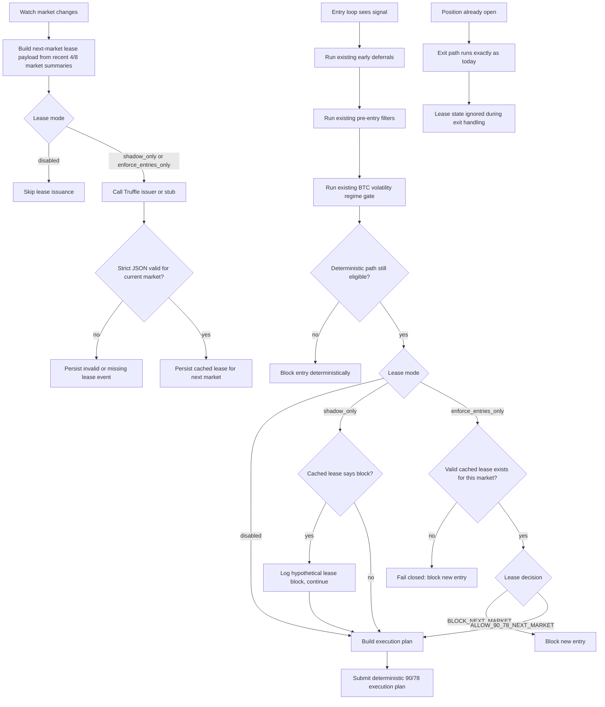

# Truffle Regime Lease Integration Spec

## Purpose

Define a detailed scaffold for integrating a Truffle-issued "regime lease" into the live Kalshi BTC 15-minute bot before any production build work starts.

The lease is a conservative supervisory decision for the next 15-minute market only. It exists to mitigate losses by standing the bot down during bad or ambiguous recent regimes. It is not a discretionary trading brain.

## One-Line Vision

Truffle issues one market-scoped lease for the next BTC15M market, and the bot consumes that lease only when deciding whether it may open a new position after all deterministic entry checks have already passed.

## Objectives

- Reduce exposure during bad recent regimes.
- Keep all exits fully deterministic and untouched.
- Keep existing deterministic safety rails primary.
- Make the feature auditable, shadow-first, and easy to disable.
- Build a narrow supervisory layer rather than a general AI trading loop.

## Non-Goals

- No Truffle-managed exits.
- No Truffle-managed order pricing, slicing, or execution mode selection.
- No per-trade narrative BTC prediction.
- No authorization of `90/70` in v1.
- No multiple conflicting lease decisions within the same market.
- No reliance on one-off microstructure snapshots as the main lease input.

## Current Bot Touchpoints

These are the current code paths the integration must respect.

- Entry loop:
  - `maybe_check_entry()`
  - `detect_entry_signal()`
  - early deferrals like stale/dead-market suppression
  - `evaluate_pre_entry_filters()`
  - `evaluate_btc_vol_regime_gate()`
  - `build_execution_plan()`
  - `submit_execution_plan()`
- Exit loop:
  - `maybe_check_exit()`
  - `detect_exit_signal()`
  - `build_exit_plan()`
  - adaptive retry / repricing logic
- Scoring path:
  - `score_bot_log.py` creates `trades.csv`, `summary.json`, and market-level outputs
- Research / dashboard path:
  - replay and optimizer tools already compare kept vs blocked trade subsets

This matters because the lease should integrate like an additional supervisory entry gate, not like a second execution engine.

## Core Design Decisions

### 1. Market-aligned lease cadence

One lease is issued for one market only.

- Lease scope: `next_market_only`
- Lease key: watched market ticker
- Lease issuance time: on watch-market rollover, startup, or explicit refresh when the watch ticker changes
- Lease validity: until the watched market changes or the lease expires/stales

This avoids the failure mode of multiple leases arriving within a single 15-minute market and interfering with entry or exit behavior.

### 2. Truffle is the issuer, the bot is the consumer

Responsibilities are split cleanly.

- Truffle:
  - receives compact recent-market summaries
  - issues a strict JSON lease decision
- Bot:
  - builds the payload
  - requests or simulates the lease
  - parses and stores the lease
  - enforces it on new entries only when configured

### 3. Deterministic checks remain primary

The lease is not asked to override obvious deterministic blocks.

The planned order of operations is:

1. detect signal
2. run existing early deterministic deferrals
3. run existing pre-entry filters
4. run existing BTC volatility regime gate
5. only if still eligible, check the Truffle lease
6. if allowed, continue to plan construction and deterministic execution

This keeps current "freshness/executable right now" logic inside the bot where it belongs.

### 4. Entries only, never exits

The lease must never:

- block an exit
- delay an exit
- change exit mode
- alter repricing or panic logic
- affect an already-held position

If a position is already open, exit logic continues exactly as it does today.

### 5. Slow recent-market summaries, not one-off microstructure

The lease should reason about recent regime behavior, not instantaneous tradeability.

Good lease inputs:

- recent exit count
- recent exit loss dollars
- settlement loss count
- rolling net PnL
- recent positive-trade fraction
- rolling stale/execution degradation summaries
- recent market outcome sequence

Bad primary lease inputs:

- current `book_age_ms`
- current `feed_age_ms`
- current `eligible_depth`
- current spread
- raw logs
- free-form prose

Those remain part of deterministic immediate trade gating inside the bot.

## V1 Lease Scope

V1 should be intentionally narrow.

Allowed decisions:

- `ALLOW_90_78_NEXT_MARKET`
- `BLOCK_NEXT_MARKET`

V1 should not:

- authorize `90/70`
- choose among many strategy families
- alter size dynamically
- manage exits

## Planned Runtime Components

### A. Lease payload builder

Builds a compact recent-market summary for the next watched market.

Planned inputs:

- recent `4` market summary
- recent `8` market summary
- last `4` market ordered sequence
- next market session label
- deterministic precheck status

### B. Lease issuer client

A pluggable caller that can support:

- `disabled`
- `shadow_only`
- `enforce_entries_only`
- `stub` issuer for local development
- Truffle HTTP / OpenAI-compatible transport later

### C. Lease parser / validator

Strict JSON parser for Truffle responses.

Invalid, missing, or stale output must be handled explicitly rather than silently tolerated.

### D. Lease cache / store

Persists the most recent lease keyed by market ticker.

Planned persisted artifacts:

- `state/truffle_regime_lease.json`
- `logs/<dataset_tag>/lease_events.ndjson`
- optional later scoring outputs under `stats/<tag>/`

### E. Recent market outcome journal

The live bot needs a lightweight runtime source for recent market summaries rather than depending on offline scoring only.

Planned artifact:

- `state/recent_market_outcomes.json`

Each record should summarize one market's known outcome for lease-building purposes.

### F. Entry-only enforcement hook

Consumes the cached lease after deterministic entry gates pass and before plan construction / submission.

## Proposed Data Models

### Market outcome record

One record per market for recent regime summaries.

Proposed fields:

- `market`
- `entry_ts`
- `resolution_ts`
- `traded`
- `outcome_type`
  - `win`
  - `exit`
  - `settlement_loss`
  - `no_trade`
  - `open_or_unresolved`
- `pnl_dollars`
- `entry_trigger_cents`
- `exit_count`
- `exit_loss_dollars`
- `stale_book_deferral_count`
- `ioc_zero_fill_count`
- `submit_latency_p95_ms`
- `session`

### Lease input schema

```json
{
  "schema_version": "lease_input_v1",
  "strategy_family": "btc15m_supervisor",
  "candidate_profile_if_allowed": "90_78",
  "lease_scope": "next_market_only",
  "next_market_ticker": "KXBTC15M-26APR201315-15",
  "next_market_session": "overnight",
  "deterministic_precheck": "PASS|BLOCK|AMBIGUOUS",
  "recent_4_markets": {
    "traded_markets": 0,
    "signal_markets": 0,
    "net_pnl_dollars": 0.0,
    "exit_count": 0,
    "exit_loss_dollars": 0.0,
    "settlement_loss_count": 0,
    "avg_entry_trigger_cents": 0.0,
    "stale_book_deferral_count": 0,
    "ioc_zero_fill_count": 0,
    "submit_latency_p95_ms": 0.0,
    "positive_trade_fraction": 0.0
  },
  "recent_8_markets": {
    "traded_markets": 0,
    "signal_markets": 0,
    "net_pnl_dollars": 0.0,
    "exit_count": 0,
    "exit_loss_dollars": 0.0,
    "settlement_loss_count": 0,
    "avg_entry_trigger_cents": 0.0,
    "stale_book_deferral_count": 0,
    "ioc_zero_fill_count": 0,
    "submit_latency_p95_ms": 0.0,
    "positive_trade_fraction": 0.0
  },
  "last_4_market_sequence": [
    {
      "market_offset": 1,
      "traded": false,
      "outcome_type": "no_trade",
      "pnl_dollars": 0.0,
      "entry_trigger_cents": null
    }
  ]
}
```

### Lease output schema

```json
{
  "schema_version": "lease_decision_v1",
  "decision": "ALLOW_90_78_NEXT_MARKET|BLOCK_NEXT_MARKET",
  "confidence": 0.0,
  "reason_codes": [
    "EXIT_CLUSTER",
    "EXIT_SEVERITY_HIGH",
    "SETTLEMENT_LOSS_PRESENT",
    "EXECUTION_DEGRADED",
    "RECENT_BLOCK_NEGATIVE",
    "RECENT_BLOCK_POSITIVE",
    "INSUFFICIENT_SAMPLE",
    "DETERMINISTIC_BLOCK",
    "AMBIGUOUS_STATE"
  ],
  "valid_for": "next_market_only",
  "market_ticker": "KXBTC15M-26APR201315-15",
  "issued_at_utc": "2026-04-20T13:00:00Z"
}
```

## Planned File-Level Changes

### `kalshi_btc15m_bot_ws.py`

Planned changes:

- extend `Config` with Truffle lease configuration
- add lease-related dataclasses / typed payload helpers or import them from a new module
- detect watch-market rollover and trigger lease issuance
- build recent-market summary payloads
- persist recent market outcome journal
- persist current lease cache
- add entry-only lease enforcement in `maybe_check_entry()`
- add lease telemetry and structured logging

Key rule:

- lease enforcement sits after deterministic filters and BTC vol gate, before `build_execution_plan()`

### New helper module, planned name `truffle_regime_lease.py`

Planned responsibilities:

- lease payload building helpers
- lease decision parser / validator
- lease cache persistence
- issuer interface
- stub issuer and Truffle transport wrapper

### `score_bot_log.py`

Planned changes:

- parse lease decision logs or artifacts
- compute shadow lease metrics such as:
  - blocked winners
  - blocked losers
  - missed profit
  - saved loss
  - net lease value
- optionally emit:
  - `lease_events.csv`
  - `lease_summary.json`

### `dashboard.py`

Planned changes:

- add lease summary panel
- add shadow performance panel
- show reason code counts
- show blocked vs allowed trade outcomes
- keep all existing scoring dashboards intact

### `README.md`

Planned changes:

- document the regime lease concept
- explain shadow vs enforce modes
- explain that exits ignore lease state

### `.env.example` and run scripts

Planned changes:

- add lease config flags
- add safe defaults
- wire a shadow-mode example first

### `tests/`

Planned additions:

- `tests/test_truffle_regime_lease.py`

Planned test coverage:

- strict schema parsing
- stale / malformed lease handling
- shadow-only path
- enforce-entries-only path
- exit path unaffected
- one-lease-per-market behavior

## Proposed Config Additions

Suggested environment variables:

- `TRUFFLE_REGIME_LEASE_MODE=disabled|shadow_only|enforce_entries_only`
- `TRUFFLE_REGIME_LEASE_ISSUER=stub|truffle_http`
- `TRUFFLE_REGIME_LEASE_TIMEOUT_MS`
- `TRUFFLE_REGIME_LEASE_CACHE_PATH`
- `TRUFFLE_REGIME_LEASE_EVENTS_PATH`
- `TRUFFLE_REGIME_LEASE_FAIL_CLOSED=true|false`
- `TRUFFLE_REGIME_LEASE_PROMPT_PATH`
- `TRUFFLE_REGIME_LEASE_MAX_STALENESS_SECONDS`

Suggested defaults:

- default mode: `disabled`
- first rollout mode: `shadow_only`
- fail closed only when `enforce_entries_only`

## Decision Logic

### Enforcement rules

- `disabled`
  - do not request or enforce lease
- `shadow_only`
  - request lease and log hypothetical result
  - never block a live entry
- `enforce_entries_only`
  - request or read cached lease
  - if missing, malformed, or stale: block new entry
  - if `BLOCK_NEXT_MARKET`: block new entry
  - if `ALLOW_90_78_NEXT_MARKET`: continue

### Why the lease check comes late

The lease is a regime filter, not a tradeability filter.

That means the bot should first reject obvious bad states itself:

- stale book
- dead market
- insufficient balance
- BTC vol regime block
- fast-fill gate failures

Only then should it consult the lease.

## Flow Chart



## Shadow-First Rollout Plan

### Phase 1: Plumbing only

- add config
- add payload builder
- add stub issuer
- add cache + artifacts
- no live enforcement

### Phase 2: Shadow with Truffle issuer

- Truffle issues real leases
- bot logs hypothetical blocks
- scorer measures:
  - blocked winners
  - blocked losers
  - net saved loss
  - missed opportunity cost

### Phase 3: Limited live enforcement

- `enforce_entries_only`
- only if shadow results are positive and stable
- exits still untouched

## Planned Evaluation Metrics

- `trades_allowed`
- `trades_hypothetically_blocked`
- `blocked_winner_count`
- `blocked_loser_count`
- `saved_loss_dollars`
- `missed_profit_dollars`
- `net_lease_value_dollars`
- `reason_code_counts`
- `lease_parse_failure_count`
- `lease_cache_miss_count`

Success should mean the lease improves realized expectancy relative to the same deterministic baseline, not just that it blocks a lot of trades.

## Open Questions To Resolve During Build

- whether to issue the lease exactly on watch-market rollover or on first eligible signal after rollover
- how much recent-market history to seed on startup
- whether recent market outcomes should be maintained entirely in runtime state or partially backfilled from scored trades
- exact transport to Truffle in the local environment
- whether dashboard work ships in the first PR or a follow-up PR

## Summary Of Planned Changes

In plain terms, this integration will:

1. add a Truffle-issued, next-market-only supervisory lease
2. keep exits fully deterministic and unaffected
3. build recent-market summary payloads inside the bot
4. store lease inputs, outputs, and errors as structured artifacts
5. add shadow-first entry gating modes
6. add later scoring of blocked-vs-allowed outcomes
7. add dashboard and documentation support for reviewing lease behavior

The resulting system should be conservative, auditable, and small enough to disable instantly if it does not help.
